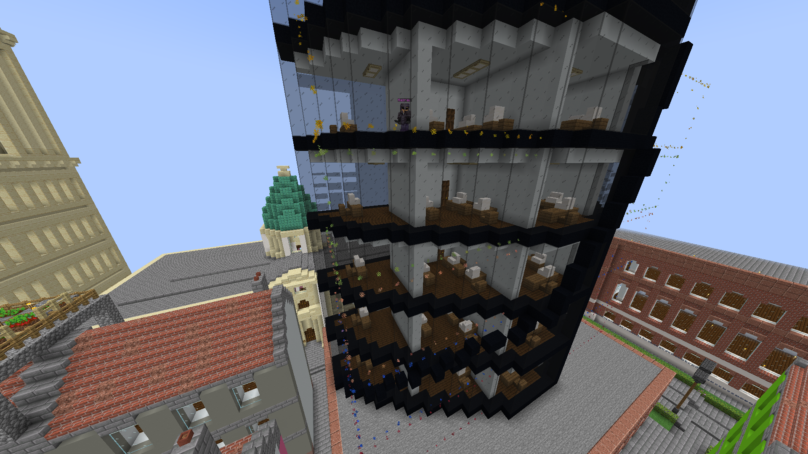

[Download Quarters (1.18+) on Modrinth](https://modrinth.com/plugin/quarters)

[Download Quarters (1.16.5) on GitHub releases](https://github.com/31893189/Quarters_1.16.5/releases)

[Wiki](https://github.com/jwkerr/Quarters/wiki)

A very shitty fork of Quarters plugin to make it compatible with version 1.16.5 (better use original plugin, otherwise use this **at your own risk**)

For any issues with this fork, open an issue on GitHub of this fork

# Quarters
<sup>Because residents deserve the bare minimum.</sup>

Quarters allows for much finer control over properties within a Towny town.

Players can use a wand or a series of user-friendly commands to subdivide their town into 3D areas. The advantage this provides over stock Towny is not being limited by the perms applying to an entire town block, you can give players permissions to much more specific areas and stop wasting your land.

The wand item is flint by default, this can be used to select two corners that form a rectangular cuboid area that can be turned into a "quarter" (as in "living quarters") by a player using `/q selection add` and then `/q create`. The flint also makes a handy tool to covertly scratch your tenant's floors to ensure you keep the security deposit.

While a player is holding the wand item, both their currently selected area and quarters that currently exist within the town they are standing in will be displayed with an outline of particles.
# Config
```yaml
technical:
  can_plugin_request_user_groups: true # If set to true, the plugin will be allowed to query GitHub for the latest sponsor data to correctly format names (please keep this enabled as sponsors are what keep development coming!)
  
wand_material: FLINT # Material of the wand item

mayor_bypasses_certain_elevated_perms: true # If this is set to true, mayors will bypass perms for certain command such as /q create, /q evict etc. This is intended to make configuration easier as most servers will want this behaviour

quarters:
  max_quarter_volume: -1 # Maximum block volume of all cuboids in a quarter combined, set to -1 for no limit
  max_quarters_per_town: -1 # Maximum amount of quarters that can be in a single town, set to -1 for no limit
  max_cuboid_volume: -1 # Maximum block volume of individual cuboids, set to -1 for no limit
  max_cuboids_per_quarter: -1 # Maximum amount of cuboids that can be in each quarter, set to -1 for no limit
  default_quarter_colour:
    enabled: false # Enable to make quarters a certain colour by default, configure colour below
    red: 63
    green: 180
    blue: 255
  allow_quarter_entry_notifications: true # If set to true, players will be allowed to toggle notifications of when they have entered a quarter
  quarter_entry_notifications_on_by_default: true # If set to false, players will have to opt in to entry notifications
  default_quarter_entry_notification_type: ACTION_BAR # Configure this to change the default quarter entry notification type

particles:
  enabled: true # Set to false to completely disable particle outlines around cuboids
  current_selection_particle: SCRAPE # Particle outline of the currently selected area
  current_cuboids_particle: WAX_OFF # Particle outline of current cuboids added to selection
  ticks_between_particle_outlines: 5 # The number of ticks between when the particle outlines of quarters will appear
  max_distance_for_cuboid_particles: 48 # The maximum distance a player can be from a cuboid before the outline particles stop being sent to their client
  default_particle_size: 1.0 # Sets the default size for particles of quarters that have been made
  allow_constant_particle_outlines: true # If set to true, players will be able to toggle quarter outlines to display constantly
  constant_particle_outlines_on_by_default: true # If set to false, players will have to opt in to constant particle outlines
  allow_entry_particle_blinking: true # If set to true, players will be able to toggle quarter outlines to blink when entered
  entry_particle_blinking_on_by_default: false # If set to true, quarters will blink their particles for one tick upon entry by a player, this can be a good alternative to constant particle outlines if it is causing lag

```

